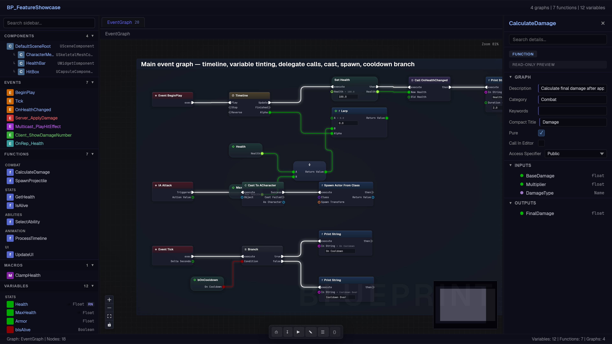

# ue-flow

An open-source Unreal Engine 5 Blueprint rendering suite. Parses UE5 T3D clipboard paste text and renders interactive Blueprint graph visualizations as self-contained HTML files or PNG screenshots.



## Features

- **Interactive graph viewer** built on React Flow with pan, zoom, selection, and node drag
- **16+ semantic node types** with type-colored headers (events, functions, branches, variables, macros, casts, switches, reroutes, comments, and more)
- **18 pin categories** with distinct colors, plus extended sub-type colors for Vector, Rotator, Transform, LinearColor, GameplayTag, and others
- **Exec pin arrows** rendered via CSS `clip-path` with connected/disconnected states
- **Pin value editing** for bool, int, float, string, vector, color, and enum types with undo/redo
- **Multi-graph viewer** with closeable tabs, breadcrumb navigation, and sidebar with search
- **Details panel** with 8 property inspector views (event, function, variable, struct, delegate, datatable, component, macro)
- **Comment nodes** with custom UE color parsing, frosted glass effect, resize, and group-drag
- **Export toolbar** with T3D copy, file download, editor push, LLM context, and markdown export
- **Bi-directional editing** — edit pin values in the browser, export modified T3D back to UE
- **Self-contained HTML** output with all JS, CSS, and fonts inlined (no external dependencies)
- **Python CLI** for rendering T3D files to HTML or PNG from the command line
- **AI chat panel** with dual-provider support — free via Google Gemini or BYOK via OpenRouter with curated model selection
- **AI Blueprint generation** — describe logic in natural language, AI generates Blueprint nodes that render on canvas with preview modal
- **Selection-aware AI** — selected node context injected into AI prompts, dynamic suggested prompts, and one-shot node explanation cards
- **Clickable AI findings** — node titles in Review results become navigation links
- **Graph analysis** API for execution tracing, data dependencies, dead end detection, and diff
- **~111 tests** across Python (pytest) and JavaScript (Vitest + Playwright)

## Quick Start

### Python (CLI)

```bash
pip install ue-flow

# Render T3D paste text to interactive HTML
ue-flow render blueprint.txt output.html

# Render to PNG (requires playwright)
pip install ue-flow[png]
ue-flow render blueprint.txt output.png
```

### Python (Library)

```python
import ue_flow

# Parse T3D paste text
graph = ue_flow.parse(t3d_text)

# Render to HTML
ue_flow.render_html(t3d_text, "output.html")

# Serialize to JSON
json_data = ue_flow.to_json(graph)

# Analyze execution flow
summary = ue_flow.summarize(graph, format="context")

# Validate graph structure
issues = ue_flow.validate_graph(graph)

# Compare two graphs
diff = ue_flow.diff_graphs(graph_a, graph_b)
```

### JavaScript (Development)

```bash
cd js
npm install
npm run dev     # Start dev server
npm run build   # Production build (IIFE bundle)
npm test        # Run unit tests
```

## Architecture

```
T3D Paste Text  ->  Python Parser  ->  BlueprintGraph Model  ->  JSON  ->  React Flow Renderer
                    (t3d_parser.py)    (t3d_models.py)           (t3d_json.py)  (App.tsx)
```

Reverse path (browser export):
```
React Flow State  ->  flow-to-t3d.ts  ->  T3D Paste Text (clipboard / file / UE editor)
```

### Project Structure

```
js/                         React/Vite frontend (TypeScript, @xyflow/react)
  src/
    App.tsx                 Root: SingleGraphView + MultiGraphView
    components/             UI chrome (Sidebar, DetailsPanel, TabBar, TopBar, StatusBar, etc.)
    nodes/                  BlueprintNode, CommentNode, NodeHeader, PinHandle, PinValueEditor
    edges/                  BlueprintEdge (bezier with type-colored glow)
    hooks/                  useTabNavigation, useUndoRedo, useAIChat, useAIAction
    transform/              json-to-flow.ts (UE JSON -> React Flow), flow-to-t3d.ts (reverse)
    types/                  ue-graph.ts, pin-types.ts, flow-types.ts
    utils/                  graph-context.ts (AI context), ai-generate.ts (Blueprint generation)
    theme/                  ue-flow.css (~3500 lines), self-hosted fonts (Geist, JetBrainsMono)
  e2e/                      Playwright smoke tests
python/
  ue_flow/
    t3d_parser.py           T3D paste text parser (regex + state machine tokenizer)
    t3d_models.py           Data models: BlueprintGraph, BlueprintNode, BlueprintPin
    t3d_json.py             JSON serializer with type inference and title mapping
    t3d_serializer.py       T3D text serializer (inverse of parser)
    t3d_layout.py           Auto-layout engine (topological sort + BFS)
    renderer.py             Single-graph HTML/PNG renderer
    renderer_multi.py       Multi-graph HTML renderer + BlueprintManifest
    graph_analysis.py       Execution tracing, data dependencies, summarization
    graph_ops.py            Validation, batch edits, query, structural diff
    cli.py                  CLI entry point (ue-flow render)
    exceptions.py           UEFlowError hierarchy
    assets/                 Built IIFE JS bundle (auto-copied from js/dist/)
  tests/                    92 pytest tests
schema/
  ue-graph.schema.json      JSON Schema (Draft 2020-12) for graph data
examples/
  mock-render.html          Multi-graph visual testing fixture
  BP_PlayerCharacter.html   Real blueprint rendered example
```

## Node Types

| Type | Header Color | Description |
|------|-------------|-------------|
| `event` | Red (#B40000) | Event nodes (BeginPlay, Tick, custom events) |
| `call_function` | Blue (#1060A8) | Function calls |
| `function_entry` | Red | Function entry points |
| `function_result` | Red | Function return nodes |
| `branch` | Gray (#404040) | Branch/conditional nodes |
| `variable_get` | Green (#208050) | Variable getter (pill shape) |
| `variable_set` | Green | Variable setter (pill shape) |
| `macro` | Purple (#8020a0) | Macro instances |
| `cast` | Teal | Cast nodes |
| `switch` | Olive | Switch/select nodes |
| `comment` | Custom RGBA | Resizable comment blocks |
| `reroute` | Pin color | Minimal 16px routing dots |

## Pin Categories

18 pin types with distinct colors: `exec` (white), `bool` (dark red), `real`/`float` (green), `int` (cyan), `byte` (teal), `string` (magenta), `name` (purple), `text` (pink), `object` (blue), `class` (indigo), `struct` (navy), `enum` (teal), `interface` (yellow), `delegate` (coral), `softclass`, `softobject`, `wildcard` (gray).

Extended sub-type colors for: Vector (gold), Rotator (light blue), Transform (orange), LinearColor (white), Vector2D, Vector4, GameplayTag, FieldPath, int64, uint64, double.

## Environment Variables

| Variable | Default | Description |
|----------|---------|-------------|
| `UE_BRIDGE_PORT` | `9848` | Editor bridge port for "Push to Editor" export |

## Testing

```bash
# JavaScript unit tests (16 tests)
cd js && npm test

# JavaScript e2e tests (5 Playwright smoke tests)
cd js && npx playwright test

# Python tests (92 tests)
cd python && pytest tests/ -v
```

## Building

```bash
cd js
npm run build    # Produces dist/ue-flow.iife.js + auto-copies to python/ue_flow/assets/
```

The IIFE bundle is fully self-contained: all JS, CSS, and fonts (woff2) are inlined. The Python renderer injects this bundle into an HTML template to produce standalone files with zero external dependencies.

## JSON Schema

The graph data format is defined in `schema/ue-graph.schema.json` (JSON Schema Draft 2020-12). Supports both single-graph (`UEGraphJSON`) and multi-graph (`UEMultiGraphJSON`) formats.

## License

MIT - See [LICENSE](LICENSE) for details.
